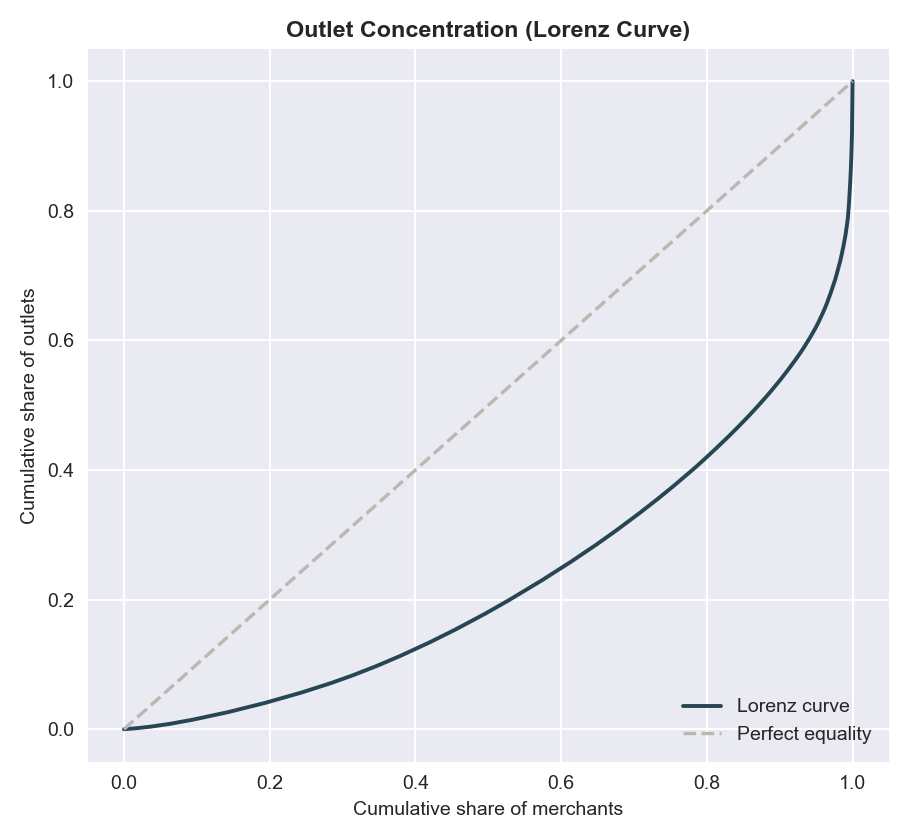
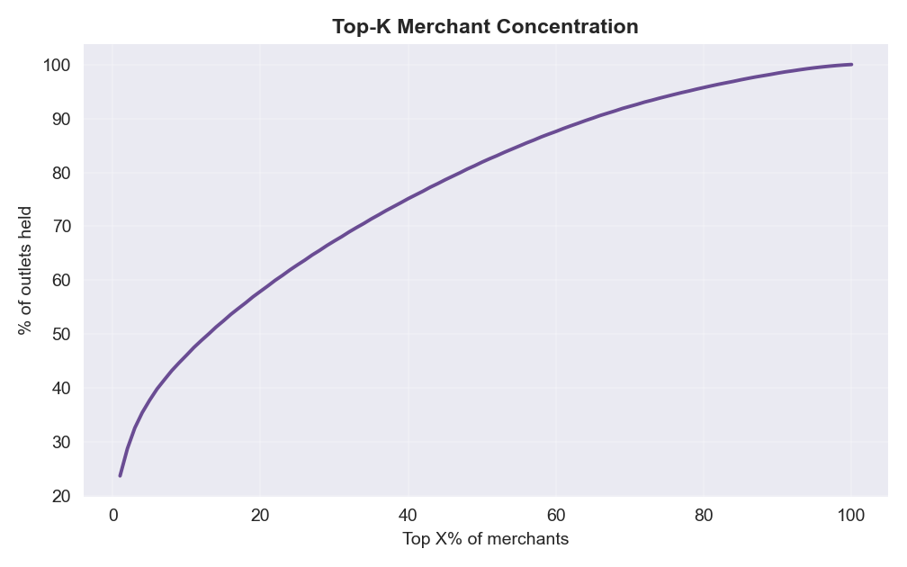
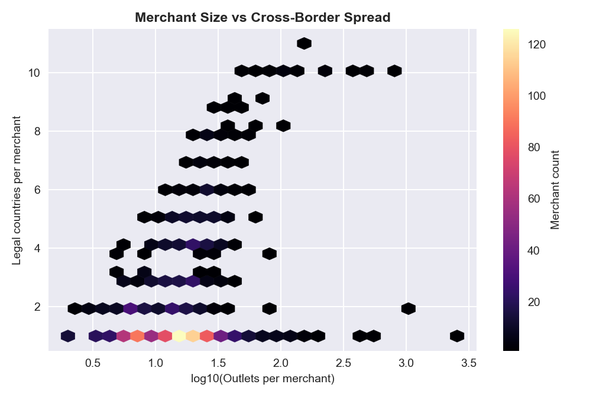
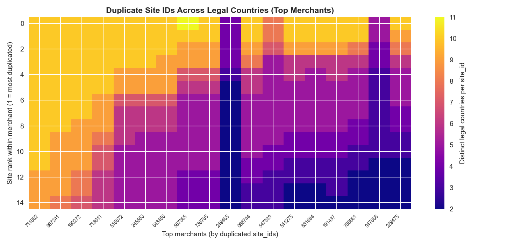
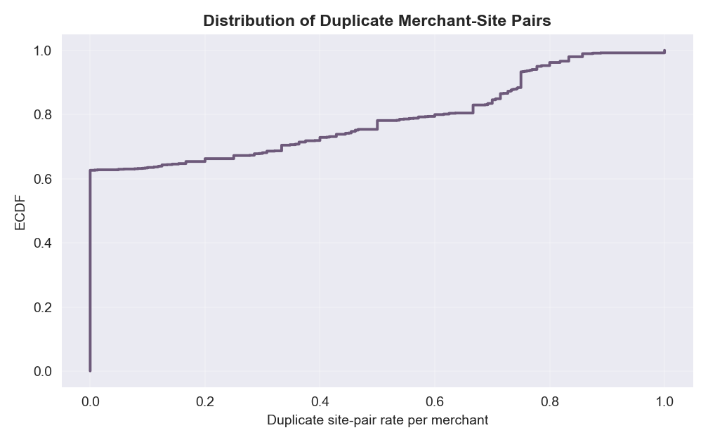

# Segment 1A — Published Assessment Report (Human‑Readable)
Date: 2026-01-30
Run: `runs\local_full_run-5\c25a2675fbfbacd952b13bb594880e92`
Scope: `data/layer1/1A` outputs only (no RNG logs). No charts by request.

## 0) Why this report exists
Segment 1A is the **world‑building foundation** for the data engine. It creates the merchant/outlet universe and the scaffolding that later segments use to simulate transactions. Your goal is not “perfect reality,” but **credible realism**: outputs that feel plausible, structurally consistent, and rich enough to support reasonable fraud modeling and explanations.

This report translates the technical assessment into plain language and connects:
- **Design intent** → what 1A is supposed to represent.
- **Implementation interpretation** → how the design was translated into data.
- **Actual output** → what this run produced.
- **Realism grade** → how believable the results are for platform use.

## 1) Design intent in plain language (what 1A should represent)
1A should produce a **repeatable merchant/outlet universe** that feels like a global retail ecosystem:
- Merchants belong to countries and have **multiple outlets** (small shops, branches, locations).
- Most merchants are domestic; some are cross‑border (operate in multiple countries).
- The distribution should be **skewed**: many small merchants, a few giants with huge networks.
- There should be **policy‑driven controls**: eligibility flags, candidate sets, and gate receipts.
- Everything should be **auditable and deterministic** under a given seed and parameter hash.

## 2) Implementation interpretation (what the code actually committed to)
Key interpretation points that matter for realism:
- **S9 is the canonical validation publisher** (data is considered valid only after S9). This improves audit integrity.
- **Strict hashing and manifest fingerprints** mean outputs are tied to exact inputs; reproducibility is strong.
- **Eligibility scoping fixes** ensure “no foreign candidates” doesn’t accidentally mark a merchant as ineligible.
- **Counts parity logic** tolerates “implicit zeros” if certain count outputs are absent.

Implication for you: the data may be structurally valid even when some “approved” datasets are missing, but missing outputs **still reduce fidelity** to the design contract.

## 3) What this run actually produced (plain English inventory)
These are the 1A datasets present in this run and what they mean:
- **outlet_catalogue** → the master list of merchants and their outlets (core realism surface).
- **merchant_currency** → the primary currency assigned to each merchant.
- **s3_candidate_set** → for each merchant, which countries are considered as possible foreign expansion targets.
- **s3_base_weight_priors** → baseline weights that bias country selection.
- **crossborder_eligibility_flags** → which merchants are allowed to be cross‑border.
- **crossborder_features** → numeric features (e.g., openness) used in hurdle modeling.
- **hurdle_design_matrix** + **hurdle_pi_probs** → the “propensity” model for being multi‑site.
- **s6/membership** → actual assigned foreign‑country memberships.
- **validation and receipts** → pass/fail gate artifacts and sealing receipts.

Missing (approved but not present in data output):
- **s3_integerised_counts**
- **s3_site_sequence**
- **sparse_flag**
- **merchant_abort_log**
- **hurdle_stationarity_tests**

These missing items do not automatically break realism, but they **reduce auditability and fidelity** to the intended design contract.

## 4) What the numbers say (translated for humans)
### 4.1 Outlet distribution (how “retail‑like” the merchant universe feels)
- **Merchants:** 1,238 across **77 countries**
- **Outlets per merchant:** min 2, median 16, max 2,546
- **Country coverage per merchant:** min 1, median 1, max 11
- **Multi‑country merchants:** 37.4%
- **Outlet concentration:** top 10% of merchants hold ~46% of all outlets

**Interpretation:** This is a classic heavy‑tail distribution: most merchants are small, a few are huge. That’s realistic for retail ecosystems and a good realism signal.

### 4.1A Outlet catalogue integrity checks (core dataset deep‑dive)
These are **dataset‑level sanity checks** that tell us if the outlet universe is internally coherent and realistic:

- **Rows (outlet records):** 31,257  
- **Distinct site_id values:** 2,546  
- **Distinct merchant+site pairs:** 24,555  

**Interpretation:** There are more rows than unique merchant+site pairs, which means **duplicate merchant‑site pairs exist**. This is not necessarily wrong if the duplicates represent **different legal countries** or repeated assignments.

**Duplicate pair analysis:**
- About **12.7%** of merchant‑site pairs are duplicated.
- The duplicates differ primarily by **legal_country_iso** and **final_country_outlet_count**, while other columns stay constant.

**Interpretation:** This implies a single `site_id` can be reused across different legal countries for the same merchant. That can be acceptable **only if `site_id` is a per‑merchant index**, not a globally unique location ID. If downstream assumes site IDs are unique per country, this is a realism risk.

**Flag behavior:**
- `single_vs_multi_flag` is **True for every merchant**.
- Minimum outlets per merchant is **2** (no single‑site merchants).

**Interpretation:** This is a realism weakness. Real economies have many single‑site merchants, but this dataset has **zero**. If the flag truly means “multi‑site,” then we are over‑representing multi‑site merchants and under‑representing small businesses.

**Home vs legal country mismatch:**
- **~38.6%** of rows have `home_country_iso != legal_country_iso`.

**Interpretation:** That is a **high mismatch rate**. It could be realistic for large firms with offshore legal domicile, but for typical retail it is likely too high. This is another realism lever to adjust if you want “everyday merchant” realism.

**Internal consistency check:**
- For every `(merchant_id, legal_country_iso)` pair, **actual outlet rows exactly match `final_country_outlet_count`**.
- `site_order` is **contiguous** (no gaps) for all merchants.

**Interpretation:** The dataset is **internally coherent**. The realism concerns are about population shape (single‑site absence, high legal/home mismatch), not data integrity.

### 4.1B Outlet catalogue realism grade (core dataset)
**Grade: B‑ (Moderate realism, but skewed toward multi‑site/global behavior)**  

**Reasons for this grade:**
1) **Strong realism signals:** outlet distribution is heavy‑tailed (many small, few huge), and the dataset is internally consistent (counts match, site_order contiguous).  
2) **Major realism gap:** there are **zero single‑site merchants** (min outlets = 2; `single_vs_multi_flag` is True for all merchants). This is not realistic for everyday commerce.  
3) **High legal vs home mismatch (~38.6%)** suggests a world with unusually high offshore domicile behavior, which can be realistic for large firms but is too high for typical merchant populations.  
4) **Duplicate merchant‑site pairs (~12.7%)** are acceptable only if `site_id` is an internal per‑merchant index. If downstream assumes unique physical locations, this introduces ambiguity.  

**Summary:** The universe feels plausible in shape, but it over‑represents large/global merchants and under‑represents single‑site businesses. With single‑site inclusion and a lower home/legal mismatch, this could move to A‑ realism.

### 4.1C Outlet catalogue visuals (EDA evidence)
Plots are saved in: `reports/eda/segment_1A/plots/` and embedded below.

**1) Outlets per merchant (distribution + tail)**  
`1_outlet_hist_loglog.png` and `2_outlet_ccdf_loglog.png` show a heavy‑tailed outlet distribution: the bulk of merchants sit in the low‑to‑mid range (median **16**, p90 **36**), while a small set stretches into the hundreds and thousands (p99 **~161**, max **2,546**). The CCDF’s near‑linear log‑log tail indicates the skew is structural, not a handful of outliers. This is exactly what a plausible retail ecosystem looks like—many small firms and a few giants.  

**2) Concentration / inequality**  
`3_lorenz_curve.png` (Gini **~0.53**) and `4_topk_share_curve.png` (top 10% hold **~46%**, top 1% **~24%**) quantify concentration. This level of inequality is realistic for real retail landscapes, where large chains dominate outlet counts. The curve isn’t so extreme that it implies a monopoly world, but it is sufficiently bowed to show realistic concentration.  

**3) Home vs legal mismatch by merchant size**  
`5_mismatch_vs_size_hex.png` and `6_mismatch_by_decile.png` show mismatch rates in the **0.35–0.48** range across nearly all size bands, with only a mild dip in the largest‑merchant decile (**~0.37**). If offshore legal domicile were mostly a “large enterprise” phenomenon, you would expect mismatch to be low for small merchants and increase with size. That is not happening here, which suggests mismatch is baked into the generator broadly, not driven by size. This is a realism concern because everyday merchants typically operate under home‑country legal domicile.  

**4) Legal‑country spread per merchant**  
`7_legal_country_ecdf.png` shows most merchants are domestic (**median = 1**), but the tail is meaningful (**p90 = 5**, max 11). `8_size_vs_legal_hex.png` shows that cross‑border spread increases with merchant size, which is expected behavior: larger merchants have more international reach. This is a strong realism signal as long as the tail isn’t too dominant.  

**5) Single vs multi‑site flag sanity**  
`9_flag_violin.png` and `10_flag_jitter.png` show **all merchants flagged True**, meaning **zero single‑site merchants** in the dataset. That is a realism gap because real retail ecosystems are dominated by single‑site or very small merchants. This is a structural bias that will shape downstream model behavior (e.g., models may over‑fit to multi‑site patterns).  

**6) Candidate breadth vs actual memberships**  
`11_candidate_vs_membership_hex.png` shows **foreign candidate counts are very high** (median **37**, total candidates median **38**) while actual memberships are sparse (median **0**, only **~46%** of merchants have any foreign membership). The correlation is weak (**~0.14**). `12_candidate_gap_ecdf.png` shows large candidate‑membership gaps for most merchants. This means the policy surface is globally permissive, but realized expansion is limited—reasonable if the generator is conservative in membership assignment, but it creates a realism tension: the “world is open,” yet most merchants don’t expand.  

**7) Duplicate merchant‑site pairs**  
`13_duplicate_site_heatmap.png` and `14_dup_pair_rate_ecdf.png` show that **~37%** of merchants reuse site IDs across multiple legal countries (mean duplicate rate **~0.21**, p90 **~0.75**). This implies `site_id` is a per‑merchant index, not a globally unique location identifier. That can be valid, but it must be explicit; otherwise downstream consumers will mistakenly treat site IDs as unique outlets and misinterpret cross‑border structure.  

### 4.2 Candidate set breadth (how “globally open” merchants are)
- **Candidate countries per merchant:** min 1, median 38, max 39

**Interpretation:** Nearly every merchant has access to most countries. That feels **overly global**, and less realistic unless the simulated world is meant to be extremely international. This is a realism weakness because most merchants in real life are geographically constrained.

### 4.3 Cross‑border eligibility (policy gating realism)
- **Eligibility rate:** ~70.7%

**Interpretation:** Roughly 7 out of 10 merchants are eligible for cross‑border behavior. This is a plausible mix; it creates a meaningful distinction between eligible and ineligible populations.

### 4.4 Hurdle probabilities (likelihood of multi‑site behavior)
- **pi range:** ~0.00009 to 0.6797 (median ~0.142)

**Interpretation:** The model generates a spectrum of “propensity to be multi‑site.” The values are not extreme; most merchants are not forced into multi‑site behavior, which is realistic.

### 4.5 Cross‑border features (openness)
- **openness range:** ~0.02 to 0.53 (median ~0.19)

**Interpretation:** Openness scores sit in a plausible band, suggesting that merchants are not overwhelmingly global. However, because the candidate sets are huge, these openness scores are not constraining enough to counterbalance the global candidate universe.

### 4.6 Currency realism
- **Currencies:** 139 unique codes (from AED to ZWG)

**Interpretation:** Very strong signal of global coverage and variety. This is good realism for a global platform.

### 4.7 Foreign membership (actual assigned foreign countries)
- **Foreign countries per merchant:** min 1, median 2, max 12

**Interpretation:** This is believable: most cross‑border merchants expand to only a few countries. This partially offsets the “too global” candidate sets.

## 5) Where realism is strong vs weak
### Strong realism signals
- **Heavy‑tailed outlet distribution** (few giants, many small merchants).
- **Moderate multi‑country merchant share** (not everyone is global).
- **Hurdle probabilities are not extreme** (most merchants lean toward single‑site).
- **Currency diversity is high**, supporting global realism.

### Weak realism signals
- **Candidate sets are too broad** (median 38 out of 39 countries). This implies most merchants are “allowed” almost everywhere, which is uncommon in real economies.
- **Missing approved outputs** reduce traceability and make it harder to validate distributional assumptions (e.g., site sequencing and integerised counts).

## 6) Realism grade (1A only)
**Segment grade: B (Moderate realism)**  
**Core outlet_catalogue grade: B‑ (Moderate realism, skewed toward multi‑site/global behavior)**

**Why (segment‑level):** The outputs are internally coherent and strongly skewed in a way that matches real merchant ecosystems. However, the **global candidate universe** is too permissive, and several approved data artifacts are missing. This puts the segment in a “credible but improvable” state.

**Why (outlet_catalogue‑level):**
1) **Strong realism signals:** heavy‑tailed outlet distribution, realistic concentration (Gini ~0.53), and cross‑border spread increasing with merchant size.  
2) **Material realism gaps:** zero single‑site merchants, high home/legal mismatch (~39%) across sizes, and site_id reuse across legal countries (acceptable only if site_id is explicitly a per‑merchant index).  
3) **Net effect:** the world “feels” plausible in shape, but the population is too globally biased and under‑represents small, single‑site merchants.

## 7) What I would fix first (if realism is the priority)
1) **Introduce single‑site merchants** (ensure `single_vs_multi_flag=False` exists and outlet_count=1 is common). This is the biggest realism gap in outlet_catalogue.
2) **Reduce home/legal mismatch for small merchants** (keep high mismatch mostly for large, multi‑country firms). This will make the domicile pattern more believable.
3) **Clarify site_id semantics** (document it as per‑merchant index or make it globally unique). Downstream assumptions depend on this.
4) **Constrain candidate sets** so most merchants only see regional or realistically reachable country targets.
5) **Emit s3_site_sequence and s3_integerised_counts** to make site‑level realism auditable.
6) **Ensure sparse_flag and hurdle_stationarity_tests** exist so distributional shape is validated and reproducible.

## 8) Bottom line for platform readiness
You can build v0 on this data, but the outlet universe currently **over‑represents multi‑site and globally legalized merchants**. If you want a platform demo that “feels real,” the first three levers are: (1) add single‑site merchants, (2) lower home/legal mismatch for small merchants, and (3) clarify or de‑duplicate site_ids. Tightening candidate sets is still important, but these outlet_catalogue gaps will be the most visible realism issues to reviewers.
